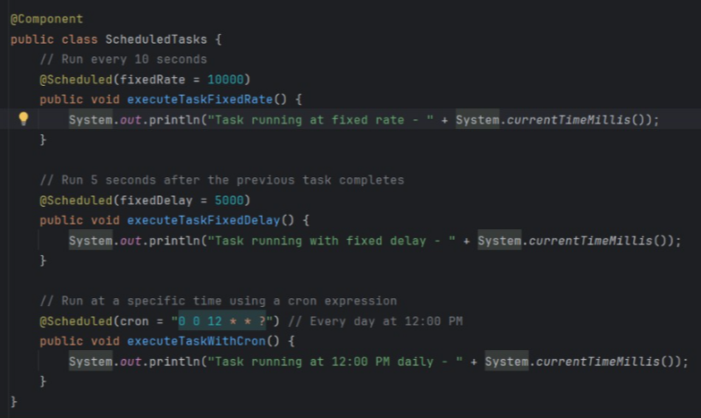
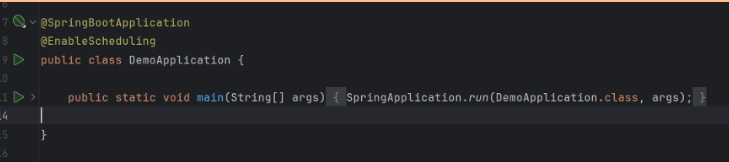

# Understanding the @Schedule Annotation in Spring Boot
## Intro
The @Schedule annotation in Spring Boot allows developers to execute tasks at predefined intervals specified directly in the code.

By leveraging this annotation, Spring Boot simplifies task scheduling and avoids the complexities that often arise with traditional Java implementations.

This makes it easier to create and manage CronJobs—periodic tasks that run automatically based on a schedule.

Pour utiliser cette annotation, il n'est pas nécessaire d'ajouter une autre dépendance.

Il suffit de créer un projet Spring Boot à partir de son starter, et vous pourrez l'utiliser librement !

Elle est située dans :
org.springframework.scheduling.annotation.Scheduled

## Common uses of CronJobs

CronJobs may be used in some of the possible following cases:

- Database cleanups
- Sending automated emails or notifications
- Syncing data with external APIs
- Generating reports at scheduled intervals

## Implementation

1.  You first create a simple project without adding any dependency> from Spring Initializer.

2. Create another file where it will reside your code for the tasking stuff (here is where @Scheduled annotation goes)

- Take a look at the methods: they must be returning void and must not accept any arguments.

- Look at the final job method: It escentially creates a job to be executed every day at 12pm. It uses the format of a CronJob.

3. The extra annotation must be added @EnableScheduling to register the jobs in the Scheduling context

